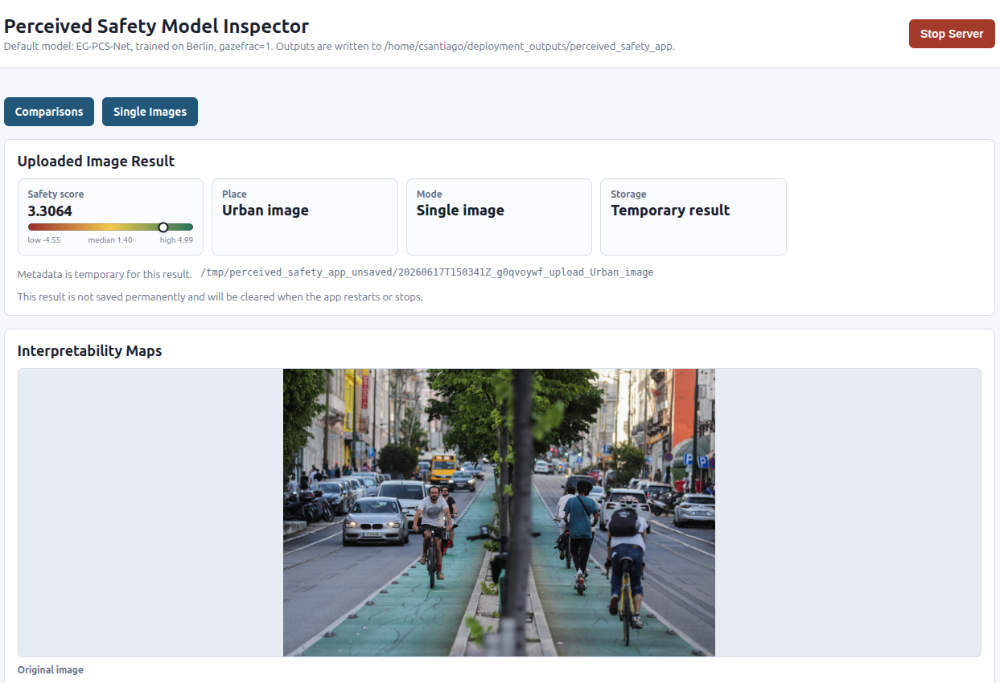
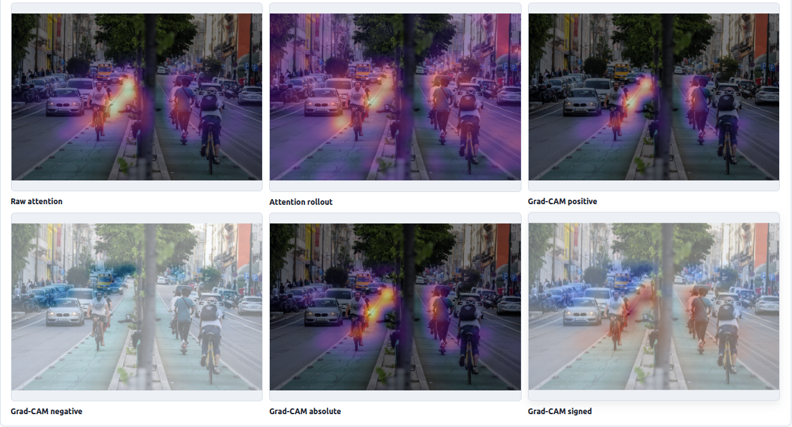

# 🚲 Learning to Look Like Humans: Gaze-Aligned Cycling Safety Prediction

## 📌 Description

Cycling provides substantial benefits for public health, urban mobility, and environmental sustainability, but many people avoid cycling when certain urban environments feel unsafe. These perceived-safety judgments are strongly shaped by visual cues in the surrounding street scene, including both static infrastructure and dynamic traffic elements.

Street-view imagery and human preference data make it possible to model these perceptions at scale, helping identify which urban layouts are perceived as safer or less safe for cycling. However, prediction alone is not enough for meaningful urban analysis. It is also important to understand **which visual regions drive the model's safety assessment** and whether those regions correspond to the areas actually inspected by humans.

This repository introduces **Eye-Tracking-Guided Perceived Cycling Safety Network (EG-PCS-Net)**, a gaze-guided framework for perceived cycling safety prediction. EG-PCS-Net uses a Siamese Vision Transformer architecture to compare pairs of street-view cycling scenes, predict perceived-safety preferences, and produce continuous perceived-safety scores.

The key idea is to make the model not only predict like humans, but also **look more like humans**. Eye-tracking data are converted into gaze-derived saliency maps and used to guide the model's internal attention during training. This improves the interpretability of the learned visual evidence while preserving competitive predictive performance.

By producing transparent and perceptually grounded safety assessments, EG-PCS-Net aims to support urban analysis and help planners better understand which visual elements may make cycling environments feel more or less inviting.

---

## 🧩 Repository Contributions

This repository brings together three connected parts of the EG-PCS project:

| Component | Purpose |
| --- | --- |
| **EG-PCS-Net** | A gaze-aligned Siamese Vision Transformer framework for perceived cycling safety prediction. |
| **EG-PCS Dataset** | A released dataset with pairwise street-view comparisons, perceived-safety labels, gaze maps, and sanitized eye-tracking source-session files. |
| **Deployment application** | A standalone interface for producing perceived-safety scores and visual attention heatmaps from street-level images. |

Together, these components support both **model development** and **interpretable urban perception analysis**.

---

## 🧠 Architecture

<p align="center">
  
</p>

EG-PCS-Net compares two street-view images using shared visual encoders and task-specific prediction branches.

- **Ranking branch:** predicts which image in a pair is perceived as safer.
- **Classification branch:** supports discrete safety-preference prediction.
- **Attention branch:** uses eye-tracking-derived saliency maps to guide or evaluate where the model attends.

The attention branch is the main interpretability component of the framework. It encourages the model's visual evidence to become more aligned with human fixation behaviour, making the safety predictions easier to inspect and compare with human attention.

---

## 📊 Dataset

This project introduces the **EG-PCS Dataset**, a research dataset for perceived cycling safety from street-level imagery. It contains pairwise street-view comparisons, perceived-safety labels, released gaze maps, and sanitized eye-tracking source-session files.

The dataset includes:

- **13,623** pairwise comparison rows;
- **9,790** released street-level images;
- **2,720** fixation-derived gaze-map files;
- **251** survey participants, including **26** laboratory eye-tracking participants;
- sanitized eye-tracking source sessions for transparency, reproducibility, and further gaze-based experiments.

The dataset is available through Zenodo:

```text
https://doi.org/10.5281/zenodo.20101496
```

Dataset documentation is provided in [`docs/dataset`](docs/dataset/), including the dataset README, dataset card, data dictionary, eye-tracking source-session guide, license notice, and citation metadata.

---

## 🖥️ Deployment Application

We provide a standalone web interface for running EG-PCS-Net inference, allowing users to obtain perceived-safety scores and visual attention heatmaps from street-level images.

<p align="center">
  
  <br><br>
  
</p>

The application is intended to make model inference and visualization easier to inspect without manually running training or evaluation scripts.

---

## 🗂️ Repository Guide

This root README gives a high-level overview of the project. Detailed usage instructions are split across the package, dataset, and application documentation.

Use this guide to find the part of the repository that matches your goal.

### 🔬 Model training and evaluation

| Goal | Location |
| --- | --- |
| Train EG-PCS-Net models | [`src/egpcs/`](src/egpcs/) |
| Evaluate trained checkpoints | [`src/egpcs/`](src/egpcs/) |
| Configure model and experiment settings | [`configs/`](configs/) |
| Read the technical training/evaluation guide | [`src/egpcs/README.md`](src/egpcs/README.md) |

The core package lives in [`src/egpcs/`](src/egpcs/). It contains the model architectures, data loading code, training loops, evaluation logic, checkpoint handling, and command-line tools.

For installation, training commands, evaluation commands, model variants, gaze-alignment settings, and troubleshooting, see [`src/egpcs/README.md`](src/egpcs/README.md).

### 📊 Dataset documentation

| Goal | Location |
| --- | --- |
| Understand the released dataset | [`docs/dataset/README.md`](docs/dataset/README.md) |
| Read intended uses, limitations, and ethics | [`docs/dataset/dataset_card.md`](docs/dataset/dataset_card.md) |
| Inspect column definitions | [`docs/dataset/DATA_DICTIONARY.md`](docs/dataset/DATA_DICTIONARY.md) |
| Understand eye-tracking source sessions | [`docs/dataset/EYE_TRACKING_SOURCES.md`](docs/dataset/EYE_TRACKING_SOURCES.md) |
| Read license and reuse notes | [`docs/dataset/DATA_LICENSE.txt`](docs/dataset/DATA_LICENSE.txt) |

The dataset documentation is intended for users who want to understand the EG-PCS release, reuse the data, inspect gaze-map availability, or report experiments correctly.

### 🖥️ Application and visualizations

| Goal | Location |
| --- | --- |
| Run the inference application | [`deployment_app/`](deployment_app/) |
| Inspect project images and figures | [`docs/`](docs/) |
| View architecture and output examples | [`docs/`](docs/) |

The deployment application provides an interface for applying EG-PCS-Net to street-level images and visualizing predicted safety scores and attention heatmaps.

New users should start with the dataset documentation if they want to use the released data, or with [`src/egpcs/README.md`](src/egpcs/README.md) if they want to train or evaluate models.

---

## 📚 How to Cite

Please cite the resources you actually use. If your work uses more than one resource, cite each applicable entry.

### Software

Cite the software when you use or adapt the training, evaluation, model, or deployment code from this repository.

```bibtex
@software{perdigao2026egpcssoftware,
  title   = {EG-PCS: Eye-Tracking-Guided Perceived Cycling Safety},
  author  = {Perdig{\~a}o, Lu{\'i}s Maria},
  year    = {2026},
  version = {0.1.0},
  url     = {https://github.com/DinhoDarroz/Eyetracking-based-guided-attention-to-model-cycling-perception-of-safety},
  license = {MIT}
}
```

### Dataset

Cite the dataset when you use its images, pairwise comparisons, perceived-safety labels, gaze maps, eye-tracking source-session files, or other released data. The dataset is published on Zenodo under CC BY 4.0.

```bibtex
@dataset{perdigao2026egpcsdataset,
  title     = {EG-PCS: Eye-Tracking-Guided Perceived Cycling Safety Dataset},
  author    = {Perdig{\~a}o, Lu{\'i}s Maria and Costa, Miguel and Santiago, Carlos and Marques, Manuel},
  year      = {2026},
  publisher = {Zenodo},
  version   = {1.1.0},
  doi       = {10.5281/zenodo.20101496},
  url       = {https://doi.org/10.5281/zenodo.20101496}
}
```

### Paper

Cite the paper when discussing the EG-PCS method, experiments, results, or scientific findings.

```bibtex
@inproceedings{perdigao2026learning,
  title     = {Learning to See Like Humans: Gaze-Aligned Cycling Safety Prediction},
  author    = {Perdig{\~a}o, Lu{\'i}s Maria and Costa, Miguel and Santiago, Carlos and Marques, Manuel},
  booktitle = {Proceedings of the IEEE International Conference on Intelligent Transportation Systems},
  year      = {2026}
}
```
